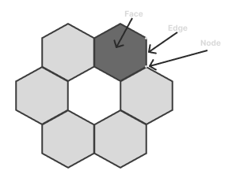

.. currentmodule:: uxarray

================================
Structured vs Unstructured Grids
================================

UXarray's ability to work on such a large variety of datasets and file formats
comes from its support for unstructured grids. Unstructured grids differ from
structured grids in how they are designed, navigated, and used in modeling functions.

Structured Grids - How They're Designed
=======================================

Structured grids are matrix-like in structure. Just as we can navigate a 2D
plane using simple coordinates like (2, 2) to (2, 3), a structured grid can be
navigated predictably because it follows a repeatable pattern.

Example
-------

A cell with a center at (20°N, 20°E) always has four neighboring cells:
(21°N, 20°E), (19°N, 20°E), (20°N, 21°E), and (20°N, 19°E).

.. image:: ../_static/examples/grids/structured_grid.png
  :width: 300
  :align: center
  :alt: A structured grid with a regular, matrix-like arrangement of cells

Moving along a structured grid has predictable outcomes and observations.
There are many assumptions you can make about a different cell that is 1 degree East.
It will have a predictable center, number of sides, and predictable neighboring cells
of the same characteristics.

Unstructured Grids - How They're Designed
=========================================

Unstructured grids do not follow a repeated, predictable pattern, and instead
can vary in shape and organization. Because of this, unstructured grids are
built like network graphs.

Each grid face will be made of nodes and edges. Those nodes and edges can be shared with
other faces to make connected faces. All the connected faces together make up the grid.

Example
-------

Here we have a grid made from hexagons. While it appears to be a repeated
pattern, it is harder to make assumptions about what the neighboring faces may
be or what characteristics they may have. Holes can exist in the grid, different
shapes like hexagons and pentagons can exist on the same grid, and more.

.. image:: ../_static/examples/grids/unstructured_grid.png
  :width: 300
  :align: center
  :alt: An unstructured grid made from hexagons

When you move one degree on a grid like the one above, you may end up in a hole,
a face of a different shape, or something entirely unexpected. That's why
the data is traversed by looking at its neighbors from connected edges.

Use Cases
=========

Many kinds of unstructured grids can exist because of these features.

Some grids use hexagons rather than a rectilinear structure:

.. image:: ../_static/examples/grids/iso_grid.png
  :width: 300
  :align: center
  :alt: An unstructured grid built from hexagonal cells

Others are allowed to have holes that cut out regions that aren't of interest in order to improve efficiency:

.. image:: ../_static/examples/grids/ocean.png
  :width: 300
  :align: center
  :alt: An unstructured ocean grid with holes cut out over land regions

Here a grid changes the size and shape of its cells to provide higher
resolution in a region of interest and coarser resolution elsewhere:

.. image:: ../_static/examples/grids/cam_se.png
  :width: 300
  :align: center
  :alt: A CAM-SE grid with variable-resolution cells refined over a region of interest

.. note::

   More info about each of the models currently supported can be seen on the `Supported Models & Grid Formats <https://uxarray.readthedocs.io/en/latest/user-guide/grid-formats.html>`__ page

Specialization & Efficiency
===========================

Structured grids face scalability limits due to several reasons such as global refinement, polar singularity,
land-ocean boundary fitting, etc. For instance, as the grid resolution scales, a global lat-lon rectilinear grid
creates too many cells near the poles, wasting massive storage/memory and compute resources for both model generation
and post-processing & analysis.

Models focused on the equator, like tropical cyclone models, will have a much higher density of cells near the poles
where they don't need data from, and a much lower density of cells near the equator, due to how the lat-lon grid scales.

On the other hand, models focused on the polar region tend to want more uniform shapes in this region, like the icosahedral
grid, which is an unstructured grid that contains hexagons of similar size uniformly across the whole grid.

Some of the value of unstructured grids comes from researchers being able to build or adopt
models that are tailored to their use case. For example, a researcher studying
measurements made across the planet's many oceans does not want to consider
cells on land. They can use a model that has no cells on land,
which creates large holes that structured grids could not run calculations on.

In a traditional lat/lon grid, ~30% of the grid cells in the previous example would be
unused, meaning the data footprint could be roughly 30% smaller. Many
calculations will likely require noticeably fewer resources, and less time will be required to
compute. Many nodes, edges, and faces are eliminated by the removal of the
land, and even the cells over the sea have fewer connected faces, nodes,
and edges as a result. These efficiency improvements matter a lot in
geospatial models, which tend to already be very resource intensive.
