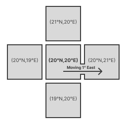
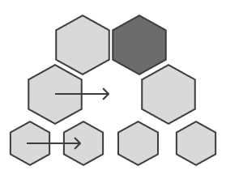
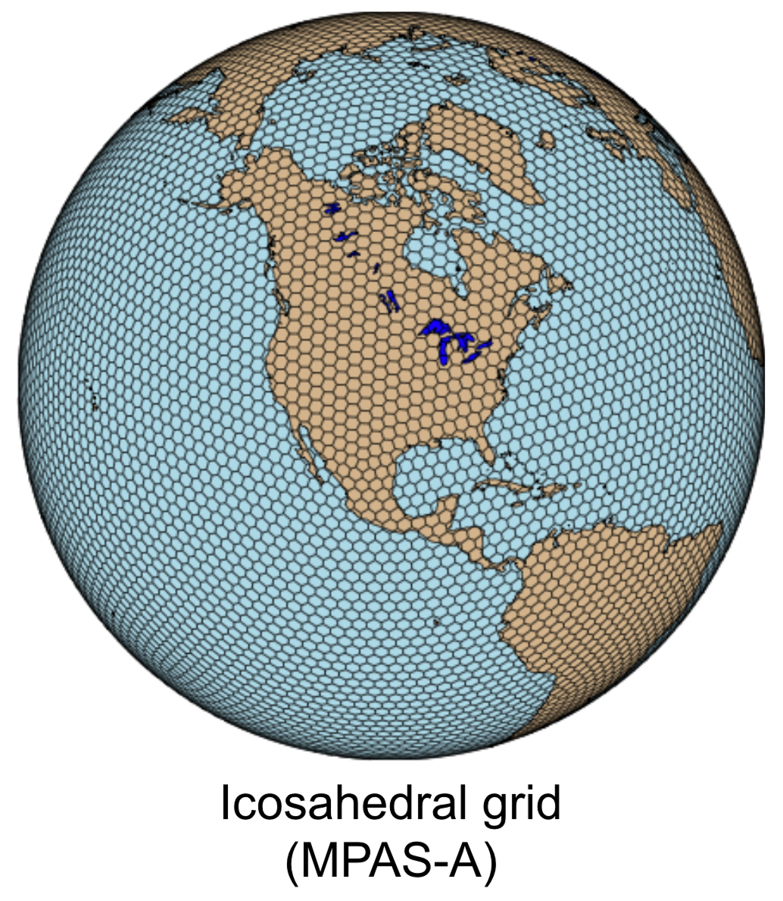
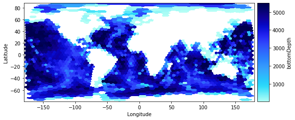
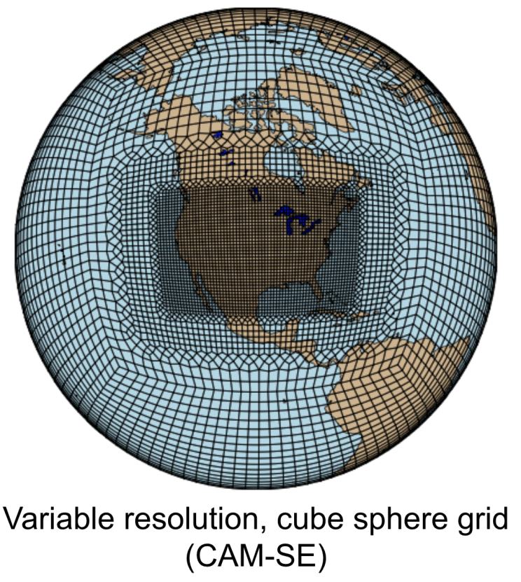

.. currentmodule:: uxarray

================================
Structured vs Unstructured Grids
================================

UXarray's ability to work on such a large variety of datasets and file formats
comes from its support for unstructured grids. Unstructured grids differ from
structured grids in how they are designed, navigated, and used in modeling functions.

Structured Grids - How They're Designed
=======================================

Structured grids are matrix-like in structure. Just as we can navigate a 2D
plane using simple coordinates like (2, 2) to (2, 3), a structured grid can be
navigated predictably because it follows a repeatable pattern.

Example
-------

A grid point with a center at (20°N, 20°E) always has four neighboring grid
points: (21°N, 20°E), (19°N, 20°E), (20°N, 21°E), and (20°N, 19°E).

Moving along a structured grid has predictable outcomes and observations.
There are many assumptions you can make about a different cell that is 1 degree East.
It will have a predictable center, number of sides, and predictable neighboring cells
of the same characteristics.

Unstructured Grids - How They're Designed
=========================================

Unstructured grids do not follow a repeated, predictable pattern, and instead
can vary in shape and organization. Because of this, unstructured grids are
built like network graphs. Grid points store information about which faces,
edges, and nodes they are connected to, and can be traversed using that
information.

Example
-------

Here we have a grid made from hexagons. While it appears to be a repeated
pattern, it is harder to navigate than a traditional grid because you cannot
simply move right by one unit and guarantee you'll be at the center of another valid grid point.
Holes can exist, the relative size can change, and more.

Similar assumptions can't be made when moving 1 degree in any direction on a grid like this. The neighboring cell
may be a different shape, it may be smaller, it may not even exist. Not all models are this
variable, but they still may break expectations in certain ways to make a beneficial trade
off in other ways.

Use Cases
=========

Many kinds of unstructured grids can exist because of these features.

Some grids use hexagons rather than a rectilinear structure:

Others are allowed to have holes that cut out regions that aren't of interest in order to improve efficiency:

Here a grid changes the size and shape of its grid points to provide higher
resolution in a region of interest and coarser resolution elsewhere:

.. note::

   More info about each of the models currently supported can be seen on the `Supported Models & Grid Formats <https://uxarray.readthedocs.io/en/latest/user-guide/grid-formats.html>`__ page

Specialization & Efficiency
===========================

Some of the value of unstructured grids comes from researchers being able to build or adopt
models that are tailored to their use case. For example, a researcher studying
measurements made across the planet's many oceans does not want to consider
grid points on land. They can use a model that has no grid points on land,
which creates large holes that structured grids could not run calculations on.

In a traditional lat/lon grid, ~30% of the grid points in the previous example would be
unused, meaning the data footprint could be roughly 30% smaller. Many
calculations will likely require noticeably fewer resources, and less time will be required to
compute. Many nodes, edges, and faces are eliminated by the removal of the
land, and even the grid points over the sea have fewer connected faces, nodes,
and edges as a result. These efficiency improvements matter a lot in
geospatial models, which tend to already be very resource intensive.
