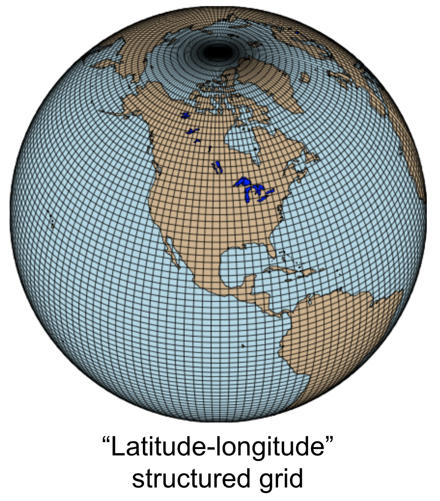
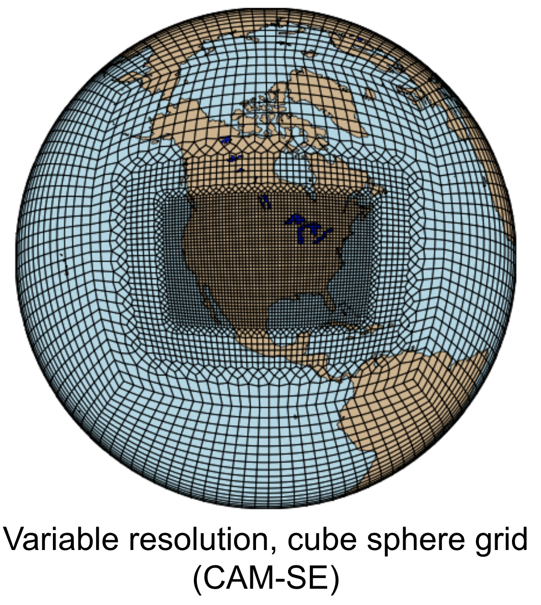

.. currentmodule:: uxarray

===========
Terminology
===========

Grid Representation
-------------------

**Structured Grids**: Structured grids are defined by regular connectivity and topology,
typically forming a uniform pattern. They are represented using a multidimensional array, where each grid point has a predictable neighbor.
This regularity simplifies the computational algorithms but may limit flexibility in handling complex geometries.

**Unstructured Grids**: Unstructured grids do not follow a regular pattern, allowing for a flexible representation of complex geometries.
They are composed of various elements such as triangles, quadrilaterals, and other larger geometries, each of which are
made up of nodes and edges.

**Node**: A point within a spherical grid, representing the vertices of the elements (such as the corners of triangles or quadrilaterals)

**Edge**: A segment that connects two nodes within a grid.

**Face**: An individual polygon that is defined by nodes connected by edges.

**Connectivity**: Connectivity describes how nodes, edges, and faces are interconnected within a grid.
It outlines the relationship between individual elements of the mesh, determining how they join together.

**Fill Value**: An arbitrary value used for representing undefined values in within connectivity variables when working
with fixed-size arrays.
